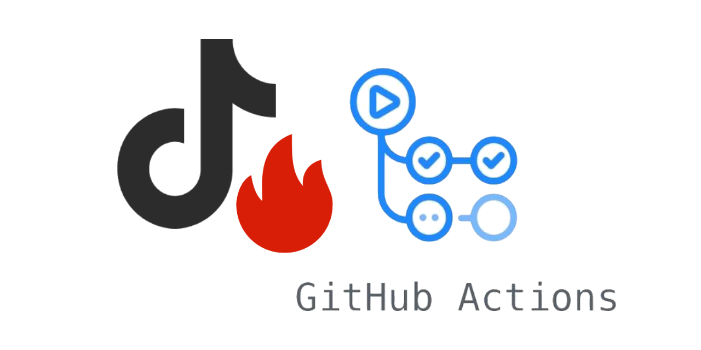

# DouYin Spark Flow

抖音火花自动续火脚本，通过无头浏览器模拟人工操作，定时给好友发送消息来续火花。

## 特性

- 多账号、多目标，一个账号可同时给多个好友续火花
- 支持按备注 / 昵称 / 抖音号匹配目标好友
- 支持「每日一言」消息模板
- 本地配置生成器（app）自动抓取登录态，无需手动导出 Cookie

## 快速开始

DouYinSparkFlow 可部署在云电脑、挂机宝、NAS、服务器等常开设备上，也可在需要关机的个人电脑上运行。系统方面支持 Windows 与 Linux，macOS 仅支持 Docker 部署。部署方式包括发行包（Windows 可执行文件、Linux .deb）与 Docker，其中**无桌面环境仅支持 Docker 部署**。

本项目对 CPU 性能没有特殊要求，但至少需要预留 1G 内存用于触发定时任务。以 Linux 为例：无桌面环境下设备内存需 > 2G，有桌面环境需 > 4G。

在开始部署前需要了解：**个人电脑部署需要每天至少开机一次**才能正常触发任务，若想完全自动化，需要准备一台长期在线的设备。常见常开设备对比如下：

| 类型 | 特点 | 参考价格 |
| --- | --- | --- |
| 云电脑 | 云端带图形桌面的虚拟机，可远程登录、扫码配置；出口 IP 可固定；权限与配置较完整 | 约 ¥30–¥100+ / 月（常有新用户低价活动） |
| 挂机宝 | 专为挂机的小型云主机，多为 Windows 桌面、长期在线；便宜，但性能与权限有限 | 约 ¥5–¥30 / 月（部分低至几元 / 月） |
| NAS | 家庭 / 个人网络存储，长期在线、可跑 Docker；已有设备则无额外成本；出口 IP 多为家庭宽带（可能无公网 IP） | 硬件一次性 ¥1000–¥5000+；电费约 ¥10–¥30 / 月 |
| 服务器 | 云服务器 / VPS，通常无桌面（Linux），出口 IP 固定、稳定，适合 Docker 部署；需自行运维 | 轻量服务器约 ¥24–¥100 / 年（活动价）～ ¥50–¥200+ / 月 |

> 价格随服务商、配置与活动波动较大，以上仅为大致参考。

选择建议：想省心、需要桌面扫码 → 云电脑 / 挂机宝；已有 NAS → 直接复用；追求稳定与固定出口 IP → 服务器。

具体部署教程，见 [选择部署方式](guide/01-选择部署方式.md)。

## 链接

- [GitHub 仓库](https://github.com/2061360308/DouYinSparkFlow)
- [讨论区](https://github.com/2061360308/DouYinSparkFlow/discussions)
